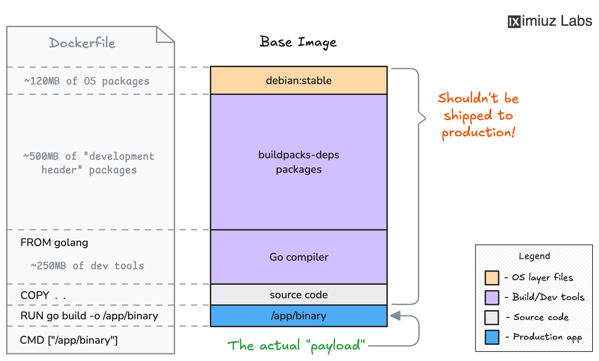

<div align="center">

# Backend Dockerfile Challenge


</div>

---

## Objective

Create a Docker image for the Go backend that:

- Uses an image with the Go compiler
- Copies source code into the container
- Compiles with `go build`
- Starts the compiled binary by default

---

## Dockerfile Used

```dockerfile
FROM golang:1.26-alpine

WORKDIR /app
COPY . .
RUN go build -o app

EXPOSE 8080
CMD ["./app"]
```

---

## Build and Run

```bash
docker build -t my-backend:v1.0.0 .
docker run --rm -p 8080:8080 my-backend:v1.0.0
```

Expected startup log:

```text
Backend listening on :8080
```

---

## Screenshot



---

## Problems Faced

1. Build failed due to Go version mismatch:
   `go.mod requires go >= 1.26 (running go 1.22.12)`.
   Fix: changed image to `golang:1.26-alpine`.
2. Tried copying `go.sum` but file was missing.
   Fix: adjusted Dockerfile flow to current repo structure.
3. `curl localhost:8080` returned `404`.
   Cause: root route `/` not implemented.
   Correct checks: `/api/health` and `/api/message`.

---

## What I Learned (Go First Experience)

- `go.mod` controls required Go version and Docker must follow it.
- `go build -o <binary>` produces the exact executable used by container `CMD`.
- `404` can be expected if route is not defined, even when server is healthy.
- API endpoint validation with `curl -v` is essential for backend debugging.
