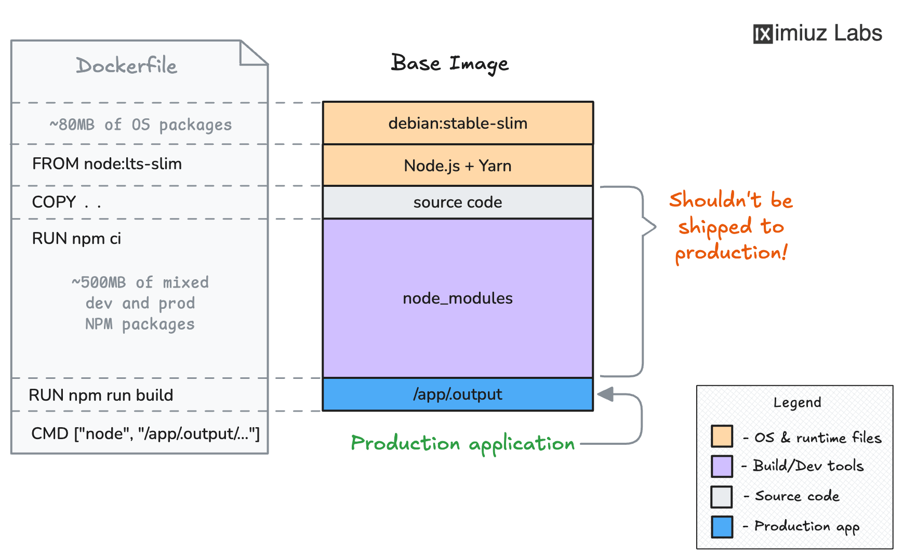

<div align="center">

# Frontend Dockerfile Challenge


</div>

---

## Objective

Create a Docker image for a TypeScript frontend that:

- installs dependencies
- compiles TypeScript
- runs compiled output at startup
- serves on port `3000`

---

## Concept Primer

TypeScript source (`.ts`) cannot run directly in this setup.
You must generate runtime JS output (`dist/server.js`) during build.

So Docker workflow is:

1. copy source
2. compile with `npm run build`
3. run compiled JS with Node

---

## Dockerfile Used

```dockerfile
FROM node:20-alpine

WORKDIR /app
COPY . .
RUN npm run build

EXPOSE 3000
CMD ["node", "dist/server.js"]
```

---

## Build and Run

```bash
docker build -t my-frontend:v1.0.0 .
docker run --rm -p 3000:3000 my-frontend:v1.0.0
```

Quick checks:

```bash
curl http://localhost:3000
curl http://localhost:3000/api/health
```

---

## Problems Faced

1. `Cannot find module '/node dist/server.js'`.
Cause: broken `CMD` syntax.
Fix: `CMD ["node", "dist/server.js"]`.

2. Health test failed when endpoint path was malformed (`//api/health`).
Fix: use exact route `/api/health`.

3. Port `3000` conflict from another process/container.
Fix: stop previous process or map another host port.

4. Homepage looked static and caused confusion.
Fix: validate behavior endpoint-by-endpoint, not only `/`.

---

## Validation Checklist

- [ ] image builds with no compile errors
- [ ] container starts and stays up
- [ ] `/api/health` returns expected output
- [ ] no module/path error in container logs

---

## Build Evidence


