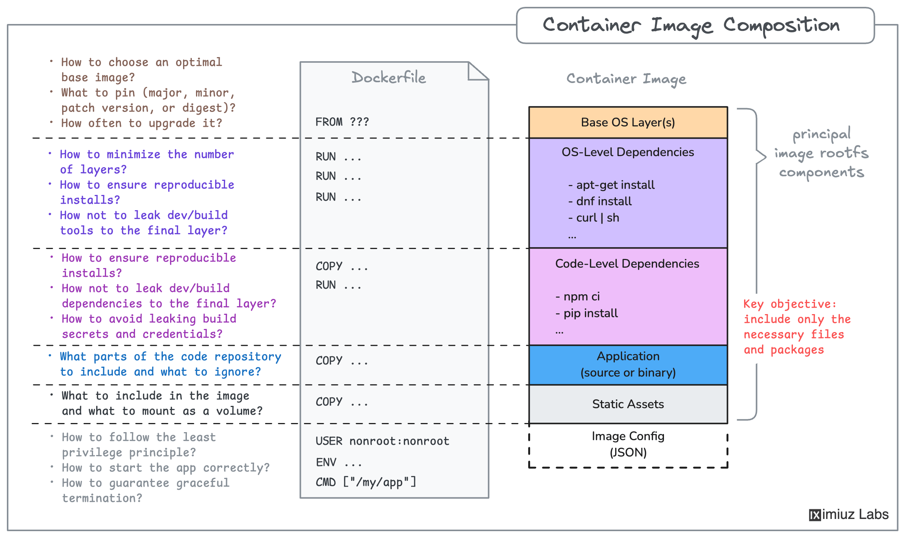

<div align="center">

# Exclude Dev Dependencies from Production Image

<p><strong>Write a Dockerfile that ships only runtime Node.js dependencies</strong></p>


</div>

---

## Original Challenge (Preserved)

Write a Dockerfile that excludes dev dependencies from the final production image while keeping the app runnable on port `3000`.

---

## Objective

In `~/app`:

- create Dockerfile
- build image `my-app:v1.0.0`
- run app successfully on `3000`
- ensure dev-only packages are excluded from final image

---

## Concept Primer

`package.json` has two dependency groups:

- `dependencies`: required at runtime (example: `express`)
- `devDependencies`: required for development only (`eslint`, `jest`, `nodemon`, `supertest`, ...)

If dev dependencies are included in production image:

- image size grows
- attack surface increases
- deploy/pull performance worsens

---

## Recommended Dockerfile

```dockerfile
FROM node:24-slim
WORKDIR /app
COPY package*.json ./
RUN npm ci --omit=dev
COPY . .
EXPOSE 3000
CMD ["node", "server.js"]
```

---

## Why This Works

- `npm ci` uses lockfile for deterministic install.
- `--omit=dev` prevents dev packages from being installed.
- final image keeps only what app needs to run.

---

## Build and Verify

```bash
cd ~/app
docker build -t my-app:v1.0.0 .
docker run --rm -p 3000:3000 my-app:v1.0.0
curl http://localhost:3000
curl http://localhost:3000/api/health
```

Dependency check:

```bash
docker run --rm my-app:v1.0.0 sh -c "npm ls --omit=dev --depth=0"
```

---

## Problems Faced and Fixes

1. Initial image included lint/test tooling.
Fix: switched install command to `npm ci --omit=dev`.

2. Confusion about what to include in final image.
Fix: keep only runtime dependency set and app source.

3. Validation focused only on startup.
Fix: also verify dependency tree inside container.

---

## Evidence


