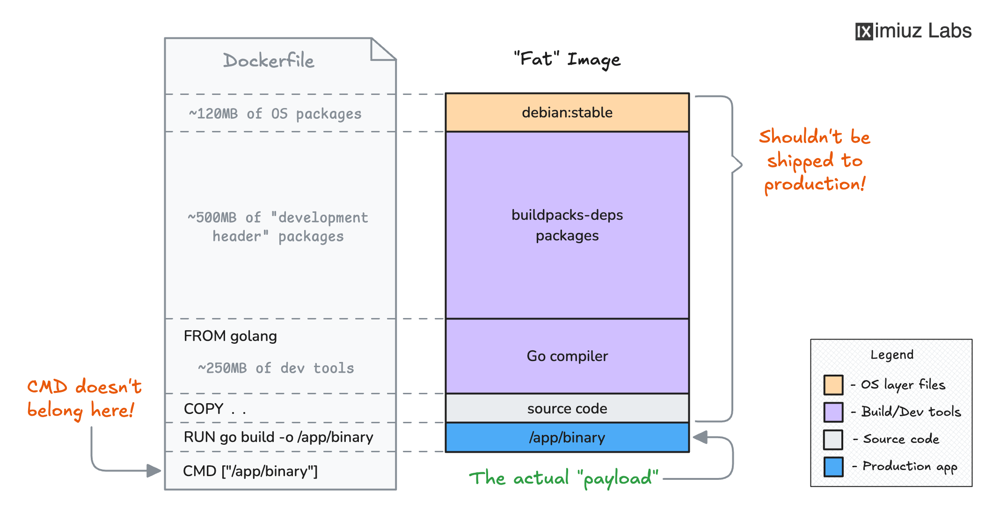
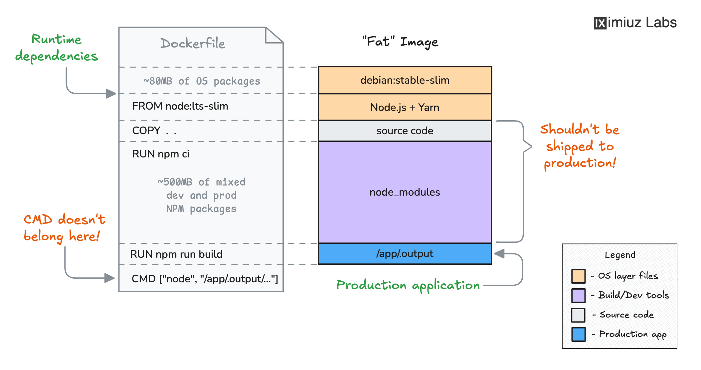
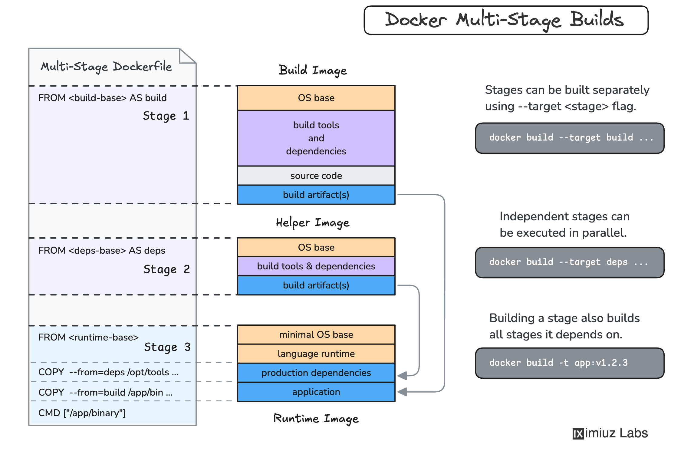

<div align="center">

# Optimize Container Images with Multi-Stage Builds

<p><strong>Goal:</strong> keep build tooling in builder stages, ship only runtime artifacts.</p>


</div>

---

## Why This Challenge

Single-stage Dockerfiles work, but they carry compilers and dev dependencies into production images.

Multi-stage builds separate:

- `build stage`: compile/transpile artifacts
- `runtime stage`: run with only required binaries/files

---

## Visual Breakdown

### 1) Go single-stage issue



### 2) Node single-stage issue



### 3) Multi-stage model



---

## Dockerfiles Implemented

### Frontend (`./frontend/Dockerfile`)

```dockerfile
FROM node:20-alpine AS builder
WORKDIR /frontend
COPY . .
RUN npm install
RUN npm run build

FROM node:20-alpine
WORKDIR /frontend
COPY package*.json .
RUN npm ci --omit=dev
COPY --from=builder /frontend/dist/server.js .
EXPOSE 3000
CMD ["node", "server.js"]
```

### Backend (`./backend/Dockerfile`)

```dockerfile
FROM golang:1.26-alpine AS builder
WORKDIR /backend
COPY . .
RUN go build -o backend

FROM alpine:3.23
WORKDIR /backend
COPY --from=builder /backend .
CMD ["./backend"]
```

---

## Build and Verify

```bash
docker build -t my-frontend:v1.0.0 ./frontend
docker run --rm -p 3000:3000 my-frontend:v1.0.0

docker build -t my-backend:v1.0.0 ./backend
docker run --rm -p 8080:8080 my-backend:v1.0.0
```

Checks:

```bash
curl http://localhost:3000
curl http://localhost:3000/api/health
```

---

## Notes from Debugging

- Initial frontend build failed because command was run in the wrong directory.
- Port `3000` conflict occurred and was fixed by removing old container.
- Backend built successfully after confirming `go 1.26` compatibility.

---

## Problems I Faced During Multi-Stage Migration

1. Ran Docker build from wrong path and got Dockerfile/context errors.
2. Port `3000` was already allocated by an old container.
3. Route check confusion:
   `//api/health` failed while `/api/health` worked.
4. Backend looked broken when `/` returned 404, but API routes were healthy.
5. While moving files between stages, wrong `COPY` target caused runtime path issues.

---

## What I Learned

- Multi-stage is not only about smaller image size; it reduces attack surface too.
- Build stage and runtime stage need different dependency sets.
- Exact path correctness in `COPY --from=builder ...` is critical.
- Use endpoint-level tests (`/api/health`, `/api/message`, `/api/greeting`) to verify integration.
- Cache can hide mistakes; rebuild with `--no-cache` when behavior is confusing.
