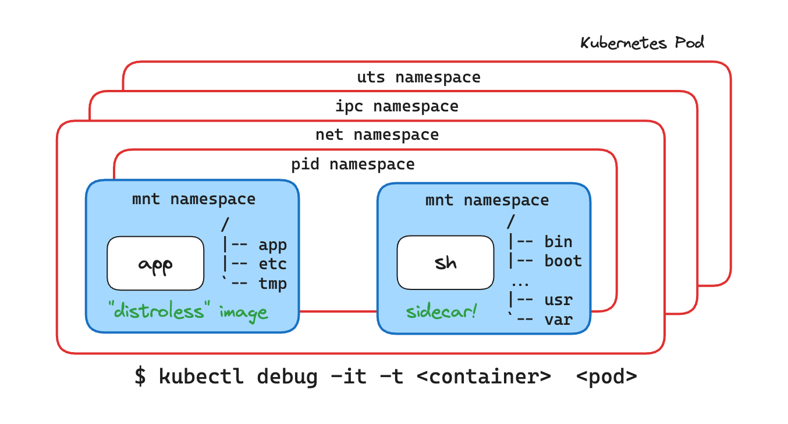

<div align="center">

# Copy Files To/From a Distroless Kubernetes Pod

<p><strong>Fix live Nginx config and export binary when `kubectl cp` fails</strong></p>


</div>

---

## Original Challenge (Preserved)

There is a Pod named `web` in `default` using `cgr.io/chainguard/nginx`.

Tasks:
- copy `~/nginx.conf` into container at `/etc/nginx/nginx.conf`
- reload Nginx without restarting pod
- copy `/usr/sbin/nginx` from pod to host as `~/nginx-bin`

---

## Why `kubectl cp` Breaks in Distroless

`kubectl cp` depends on `tar` in the target container.
Distroless images usually do not include:

- shell utilities
- package manager
- tar

So normal copy flow fails with:
`exec: "tar": executable file not found in $PATH`.

---

## Working Approach

Use an ephemeral debug container and access target container filesystem via `/proc/1/root`.

If normal `kubectl debug` is not privileged enough, create privileged ephemeral container through Kubernetes API patch.

---

## Step-by-Step

```bash
kubectl proxy &

curl -Lvk localhost:8001/api/v1/namespaces/default/pods/web/ephemeralcontainers \
  -XPATCH \
  -H 'Content-Type: application/strategic-merge-patch+json' \
  -d '
{
  "spec": {
    "ephemeralContainers": [
      {
        "name": "debugger-123",
        "command": ["sh"],
        "targetContainerName": "web",
        "image": "alpine",
        "stdin": true,
        "tty": true,
        "securityContext": { "privileged": true }
      }
    ]
  }
}'
```

Then attach and move files through `/proc/1/root`.

Reload Nginx:

```bash
kubectl exec web -- nginx -s reload
```

If PID file error appears (`/var/run/nginx.pid`), fallback to sending `HUP` to nginx process.

---

## Troubleshooting Notes

- `Permission denied` on `/proc/1/root` usually means debug container is not privileged.
- `kubectl debug` defaults may be insufficient for this case.
- `cdebug` can simplify this workflow if available.

---

## Validation Checklist

- [ ] new config exists at `/etc/nginx/nginx.conf`
- [ ] Nginx reload applied successfully
- [ ] binary copied to host as `~/nginx-bin`
- [ ] pod was not restarted

---

## Visuals




Below is the structured version you asked for — clean, interview-ready, and visual.

---

# 1️⃣ Simplified Interview Explanation Version

## 🎤 How To Explain This in an Interview

**Question:**
“How would you modify a file inside a distroless container without restarting the Pod?”

---

### ✅ Short Professional Answer

Distroless images don’t include shell or tar, so `kubectl cp` and `kubectl exec` often fail.

To modify files safely:

1. I create a **privileged ephemeral container** targeting the original container.
2. I install required tools (like tar) in the debug container.
3. Since PID namespace is shared, I access the target container’s root filesystem via:

```bash
/proc/1/root
```

4. I copy the file into the correct path.
5. I send a `SIGHUP` to PID 1 from the debug container to reload the process.
6. No restart required.

---

### 🎯 Why This Works

* Ephemeral containers share PID namespace.
* `/proc/<pid>/root` exposes the target container’s filesystem.
* Signals can be sent across containers in same pod.

---

### 🧠 Key Concepts To Mention

* Distroless limitations
* kubectl cp depends on tar
* Ephemeral containers are append-only
* PID namespace sharing
* Unix signal handling (SIGHUP)

That’s a clean senior-level explanation.

---

# 2️⃣ Visual Namespace Diagram

Below is a simplified architecture of what happened.

---

## 🧱 Pod Architecture

```
+--------------------------------------------------+
|                     POD                          |
|--------------------------------------------------|
|                                                  |
|  Shared Namespaces:                              |
|   - Network                                      |
|   - IPC                                          |
|   - (PID - because of --targetContainerName)     |
|                                                  |
|--------------------------------------------------|
|                                                  |
|  Container 1: web (distroless nginx)            |
|   - PID 1 → nginx master                        |
|   - No shell                                     |
|   - No tar                                       |
|   - No kill                                      |
|                                                  |
|--------------------------------------------------|
|                                                  |
|  Container 2: debugger-final (ephemeral)        |
|   - Alpine image                                 |
|   - Has /bin/sh                                  |
|   - Has tar                                      |
|   - Has kill                                     |
|   - Privileged                                   |
|                                                  |
+--------------------------------------------------+
```

---

## 🔎 Filesystem Access Flow

```
debugger-final container
        |
        |   Shared PID namespace
        v
/proc/1/root  --->  Root filesystem of nginx container
                          |
                          v
               /etc/nginx/nginx.conf
```

---

## 🔁 Signal Flow

```
debugger-final
     |
     | kill -HUP 1
     v
nginx master process (PID 1)
     |
     v
Reload configuration
```

---

# 3️⃣ “Common Mistakes” Cheat Sheet

This is where most people fail in real interviews and labs.

---

## ❌ Mistake 1 — Using `kubectl cp` on distroless container

Error:

```
tar: not found
```

Reason: distroless has no tar.

Fix: use debug container.

---

## ❌ Mistake 2 — Creating ephemeral container with `sh` only

```
"command": ["sh"]
```

Then exiting.

Result: container dies permanently.

Fix:

```
"command": ["/bin/sh", "-c", "sleep 3600"]
```

---

## ❌ Mistake 3 — Reusing same ephemeral container name

Error:

```
existing ephemeral containers may not be changed
```

Fix: use new name every time.

---

## ❌ Mistake 4 — Running `kubectl` inside container

Containers don’t have kubectl.

Rule:

| Host    | Container     |
| ------- | ------------- |
| kubectl | apk, cp, kill |

---

## ❌ Mistake 5 — Sending signal from distroless container

```
kubectl exec web -- kill -HUP 1
```

Fails because no kill binary.

Fix:

```
kubectl exec web -c debugger-final -- kill -HUP 1
```

---

## ❌ Mistake 6 — Confusing attach vs exec

* `attach` requires TTY allocated at creation
* `exec` works regardless

Prefer `kubectl exec`.

---

# 🔥 Final Interview Summary Line

If interviewer asks:

> “What’s the safest way to debug distroless containers?”

You answer:

> I use a privileged ephemeral container to share namespaces, access the target filesystem via `/proc/<pid>/root`, and control the process using Unix signals without restarting the Pod.

That sentence alone signals senior-level understanding.

---
Here is the complete **all-in-one Markdown documentation**, including:

* Scenario
* Problems faced
* Mistakes (both yours and mine)
* Technical explanations
* Final correct solution

You can copy this into `distroless-nginx-debug-postmortem.md`.

---

# Distroless Nginx Debugging – Full Postmortem & Final Solution

## 🎯 Scenario

* Pod: `web`
* Namespace: `default`
* Image: `cgr.dev/chainguard/nginx`
* Port: `8080`
* Problem: `nginx.conf` missing
* Requirements:

  * ❌ No Pod restart
  * ❌ Image is distroless (no shell, no tar)
  * ✅ Copy config into container
  * ✅ Reload nginx
  * ✅ Extract nginx binary to host

---

# 🚨 Core Technical Challenge

Distroless containers do NOT include:

* `/bin/sh`
* `tar`
* `kill`
* coreutils
* package manager

But:

```bash
kubectl cp
```

**depends on tar inside the container.**

So default methods fail.

---

# 🔥 Problems We Faced (Full Breakdown)

---

## 1️⃣ `kubectl cp` Failed

### Error

```bash
exec: "tar": executable file not found in $PATH
```

### Why

`kubectl cp` uses tar internally.
Distroless image has no tar.

### Fix

Add an ephemeral debug container with tar installed.

---

## 2️⃣ Ephemeral Container Exited Immediately

We created:

```json
"command": ["sh"]
```

Then exited shell.

Result:

```json
"terminated": { "exitCode": 127 }
```

### Why

Ephemeral containers:

* Cannot restart
* Cannot be removed
* If main process exits → container is permanently dead

### Correct Pattern

```json
"command": ["/bin/sh", "-c", "sleep 3600"]
```

This keeps container alive.

---

## 3️⃣ Tried Reusing Same Ephemeral Container Name

Error:

```
existing ephemeral containers may not be changed
```

### Why

Ephemeral containers are:

* Append-only
* Immutable
* Cannot be modified
* Cannot be reused

You must use a NEW name each time.

---

## 4️⃣ Tried Running `kubectl` Inside Container

You ran:

```bash
kubectl cp ...
```

Inside Alpine shell.

### Why it failed

Containers do not have:

* kubectl
* kubeconfig
* API access

Rule:

| Run On Host | Run Inside Container |
| ----------- | -------------------- |
| kubectl     | apk, cp, ls, kill    |

---

## 5️⃣ TTY Allocation Error

Error:

```
Unable to use a TTY - container did not allocate one
```

### Why

Container created without:

```json
"stdin": true,
"tty": true
```

### Fix

Use:

```bash
kubectl exec -it ...
```

Instead of attach.

---

## 6️⃣ Tried Sending Signal From Distroless Container

Command:

```bash
kubectl exec web -- kill -HUP 1
```

Error:

```
exec: "kill": executable file not found
```

### Why

Distroless has no `kill`.

### Correct Way

Send signal from debug container:

```bash
kubectl exec web -c debugger-final -- kill -HUP 1
```

---

## 7️⃣ Confusion With `/proc/1/root`

Important concept:

Inside shared PID namespace:

```bash
/proc/<PID>/root
```

Is the root filesystem of that process.

Since:

* nginx master = PID 1
* debug container shares PID namespace

So nginx filesystem is accessible at:

```bash
/proc/1/root
```

That allowed us to modify:

```bash
/proc/1/root/etc/nginx/nginx.conf
```

Without restarting Pod.

---

# 🧠 Mistakes I (Assistant) Made

To be transparent:

* I initially suggested `kubectl attach` repeatedly even though TTY wasn’t allocated.
* I did not immediately enforce the `sleep 3600` pattern.
* I should have pushed directly toward `kubectl exec` instead of attach.
* I should have simplified the workflow earlier instead of exploring multiple branches.

The correct minimal workflow is much cleaner.

---

# ✅ Final Clean Working Solution

---

## Step 1 – Start Proxy

```bash
kubectl proxy &
```

---

## Step 2 – Create Privileged Ephemeral Container

```bash
curl -Lvk localhost:8001/api/v1/namespaces/default/pods/web/ephemeralcontainers \
  -XPATCH \
  -H 'Content-Type: application/strategic-merge-patch+json' \
  -d '
{
  "spec": {
    "ephemeralContainers": [
      {
        "name": "debugger-final",
        "image": "alpine",
        "command": ["/bin/sh", "-c", "sleep 3600"],
        "targetContainerName": "web",
        "securityContext": {
          "privileged": true
        }
      }
    ]
  }
}'
```

---

## Step 3 – Install tar

```bash
kubectl exec -it web -c debugger-final -- /bin/sh
apk add tar
exit
```

---

## Step 4 – Copy Config

```bash
kubectl cp ~/nginx.conf web:/tmp/nginx.conf -c debugger-final
```

---

## Step 5 – Move Config Into Distroless RootFS

```bash
kubectl exec web -c debugger-final -- \
  cp /tmp/nginx.conf /proc/1/root/etc/nginx/nginx.conf
```

---

## Step 6 – Reload Nginx

```bash
kubectl exec web -c debugger-final -- kill -HUP 1
```

---

## Step 7 – Copy Binary Out

```bash
kubectl cp web:/proc/1/root/usr/sbin/nginx ~/nginx-bin -c debugger-final
chmod +x ~/nginx-bin
```

---

# 🏁 Final Result

✔ Config replaced
✔ Nginx reloaded
✔ Binary extracted
✔ No Pod restart
✔ Distroless limitations bypassed safely

---

# 💡 Key Technical Lessons

1. `kubectl cp` requires tar inside container
2. Ephemeral containers are immutable
3. Distroless images require external debug tooling
4. PID namespace sharing allows `/proc/<pid>/root` access
5. Signals must be sent from container that has `kill` binary
6. `attach` ≠ `exec`

---

# 🧩 What This Demonstrates

This is advanced Kubernetes runtime debugging involving:

* Container namespaces
* Privileged ephemeral containers
* Process signaling
* Filesystem traversal
* Live forensics on distroless workloads

This is senior-level container debugging.


