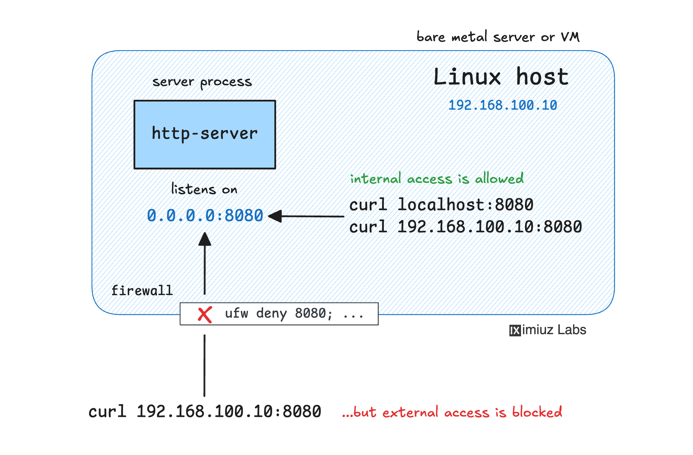

<div align="center">

# Protect VM Firewall Challenge

### Restrict port `8080` to local access only using `iptables`


</div>

---

## Challenge Objective

An HTTP service is already running on `0.0.0.0:8080`.

Your task is to:
- Allow access from this machine (localhost)
- Block access from external machines
- Use firewall rules only (do not modify or restart the service)

Server IP: `192.168.100.10/24`



For general `iptables` intro and command reference, see:
- `../iptablesChallange/README.md`

---

## Final Working Commands

```bash
# 1) allow local loopback traffic to 8080 first
sudo iptables -I INPUT 1 -i lo -p tcp --dport 8080 -j ACCEPT

# 2) block all remaining inbound traffic to 8080
sudo iptables -A INPUT -p tcp --dport 8080 -j DROP
```

---

## Why This Works

`iptables` checks rules in sequence:
1. Localhost traffic matches the first rule and is accepted
2. Any other source to `8080` matches the drop rule and is blocked

---

## Verify Rules

```bash
sudo iptables -L -n -v
```

Expected INPUT chain order:

```text
ACCEPT tcp -- 0.0.0.0/0 0.0.0.0/0 tcp dpt:8080
DROP   tcp -- 0.0.0.0/0 0.0.0.0/0 tcp dpt:8080
```

---

## Validation

Local check (should succeed):

```bash
curl http://127.0.0.1:8080
```

External check from another host (should fail):

```bash
curl http://192.168.100.10:8080
```

---

## Troubleshooting

If rules were added in the wrong order:

```bash
sudo iptables -L INPUT --line-numbers -n -v
sudo iptables -D INPUT <RULE_NUMBER>
```

Then insert allow rule first, and append drop rule.

---

## Result

- Local access to `8080`: PASS
- External access to `8080`: BLOCKED
- Service process/config changed: NO
